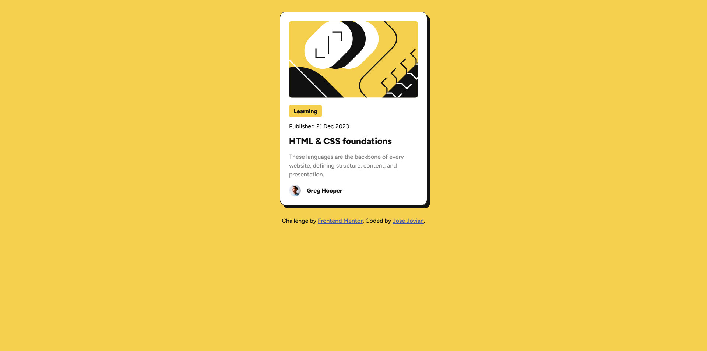
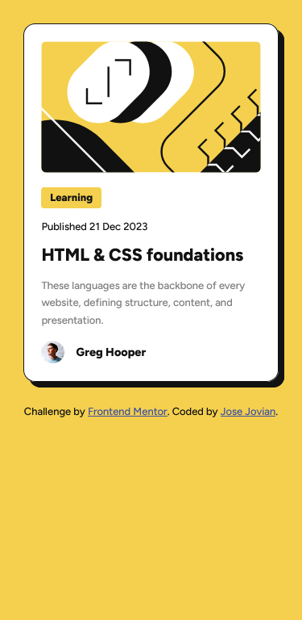

# Frontend Mentor - Blog preview card solution

This is a solution to the [Blog preview card challenge on Frontend Mentor](https://www.frontendmentor.io/challenges/blog-preview-card-ckPaj01IcS). Frontend Mentor challenges help you improve your coding skills by building realistic projects. 

## Table of contents

- [Frontend Mentor - Blog preview card solution](#frontend-mentor---blog-preview-card-solution)
	- [Table of contents](#table-of-contents)
	- [Overview](#overview)
		- [Screenshot](#screenshot)
		- [Links](#links)
	- [My process](#my-process)
		- [Built with](#built-with)
		- [What I learned](#what-i-learned)
		- [Continued development](#continued-development)
	- [Author](#author)

## Overview

### Screenshot

### Links

- [Solution URL](https://github.com/josejovian/frontendmentor-challenges/tree/main/blog-preview-card-main)
- [Live Site URL](https://josejovian.github.io/frontendmentor-challenges/blog-preview-card-main/)

## My process

### Built with

- Semantic HTML5 markup
- CSS custom properties

### What I learned

In this challenge, clamp is a nice way to dynamically control font sizes without having to resort to media queries.

### Continued development

There seem to be more interesting CSS functions that I should look into and possibly use in the future.

## Author

- GitHub - [Jose Jovian](https://github.com/josejovian)