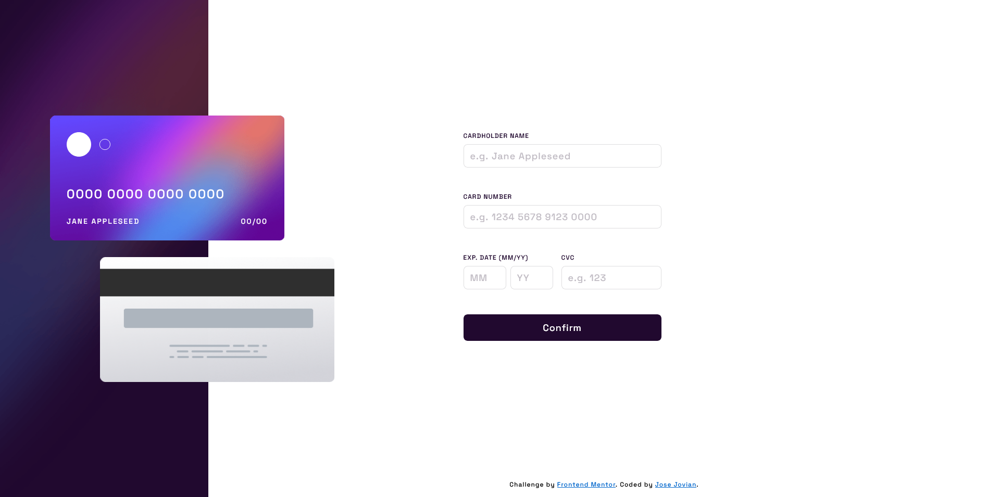
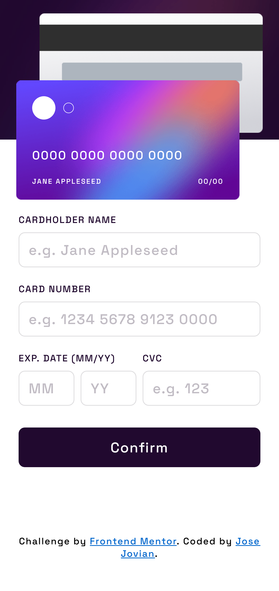

# Frontend Mentor - Interactive card details form solution

This is a solution to the [Interactive card details form challenge on Frontend Mentor](https://www.frontendmentor.io/challenges/interactive-card-details-form-XpS8cKZDWw). Frontend Mentor challenges help you improve your coding skills by building realistic projects. 

## Table of contents

- [Frontend Mentor - Interactive card details form solution](#frontend-mentor---interactive-card-details-form-solution)
	- [Table of contents](#table-of-contents)
	- [Overview](#overview)
		- [The challenge](#the-challenge)
		- [Screenshot](#screenshot)
		- [Links](#links)
	- [My process](#my-process)
		- [Built with](#built-with)
		- [What I learned](#what-i-learned)
		- [Continued development](#continued-development)
		- [Useful resources](#useful-resources)
	- [Author](#author)

## Overview

### The challenge

Users should be able to:

- Fill in the form and see the card details update in real-time
- Receive error messages when the form is submitted if:
  - Any input field is empty
  - The card number, expiry date, or CVC fields are in the wrong format
- View the optimal layout depending on their device's screen size
- See hover, active, and focus states for interactive elements on the page

### Screenshot

### Links

- [Solution URL](https://github.com/josejovian/frontendmentor-challenges/tree/main/interactive-card-details-form-main)
- [Live Site URL](https://josejovian.github.io/frontendmentor-challenges/interactive-card-details-form-main/)

## My process

### Built with

- Semantic HTML5 markup
- CSS custom properties
- Flexbox
- CSS Grid
- SASS

### What I learned

I may have spent too much time styling the cards' position. Though I've finished the styling and it does look decent, it somehow felt like I did too much just to position the cards. It was probably the `calc` function, or the very specific px sizes.

### Continued development

I'll focus more on the styling aspect.

### Useful resources

- [Regex 101](https://regex101.com/) - Useful website to test regular expressions.
- [CSS gradient](https://cssgradient.io/) - Useful website to quickly generate a gradient background. 

## Author

- GitHub - [Jose Jovian](https://github.com/josejovian)