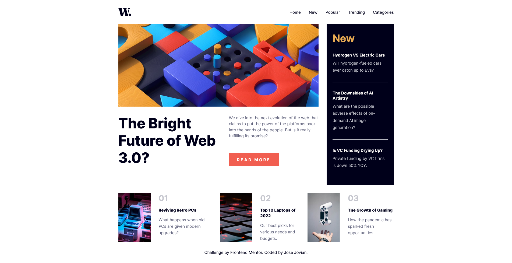
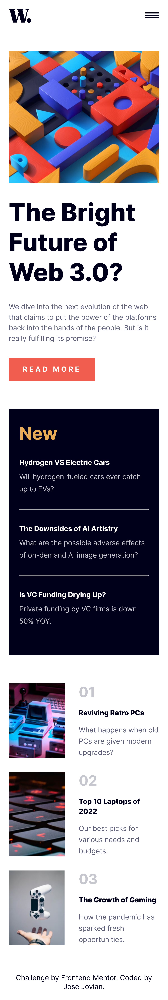

# Frontend Mentor - News homepage solution

This is a solution to the [News homepage challenge on Frontend Mentor](https://www.frontendmentor.io/challenges/news-homepage-H6SWTa1MFl). Frontend Mentor challenges help you improve your coding skills by building realistic projects. 

## Table of contents

- [Frontend Mentor - News homepage solution](#frontend-mentor---news-homepage-solution)
	- [Table of contents](#table-of-contents)
	- [Overview](#overview)
		- [The challenge](#the-challenge)
		- [Screenshot](#screenshot)
		- [Links](#links)
	- [My process](#my-process)
		- [Built with](#built-with)
		- [What I learned](#what-i-learned)
		- [Continued development](#continued-development)
	- [Author](#author)

**Note: Delete this note and update the table of contents based on what sections you keep.**

## Overview

### The challenge

Users should be able to:

- View the optimal layout for the interface depending on their device's screen size
- See hover and focus states for all interactive elements on the page
- 
### Screenshot

### Links

- [Solution URL](https://github.com/josejovian/frontendmentor-challenges/tree/main/news-homepage-main)
- [Live Site URL](https://josejovian.github.io/frontendmentor-challenges/news-homepage-main/)

## My process

### Built with

- Semantic HTML5 markup
- CSS custom properties
- Flexbox
- CSS Grid
- SASS

### What I learned

I spent a lot of time trying to make the "read more" button perfectly aligned with the side bar, until I realised that this would be hard to do without making it look weird on some view sizes.

### Continued development

I didn't really use much SASS features in this challenge (I only used the nested styling), so I hope I get to properly use more interesting features in the other challenges.

## Author

- GitHub - [Jose Jovian](https://github.com/josejovian)