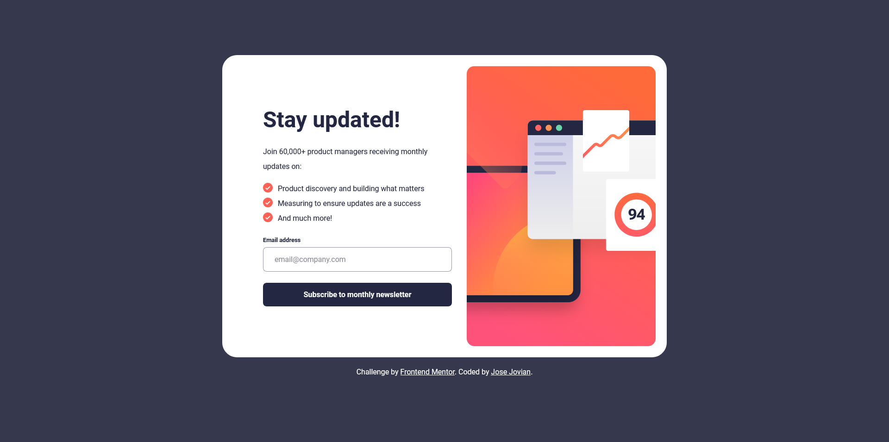
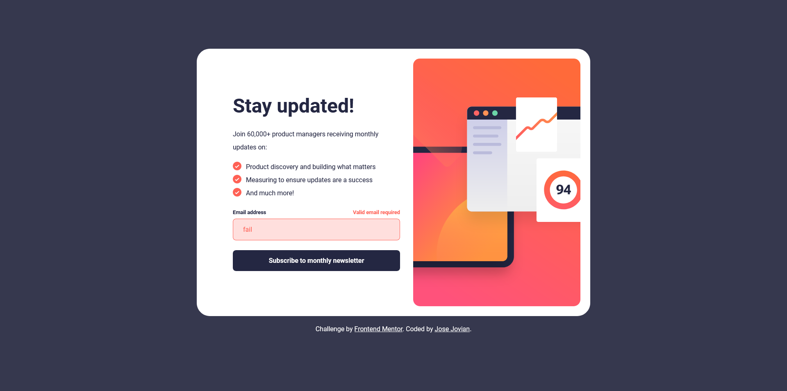
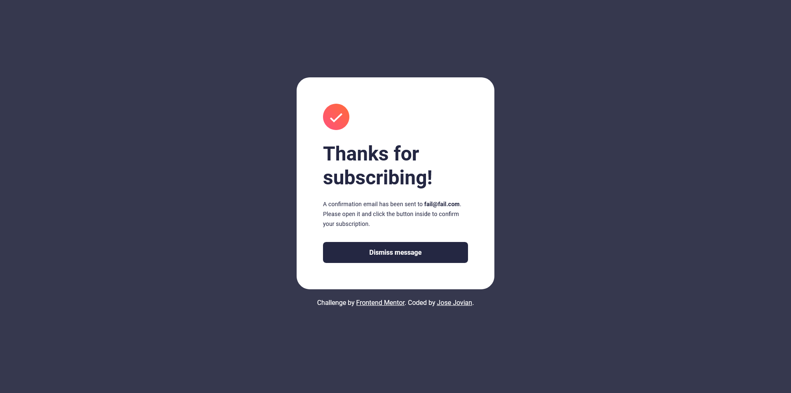
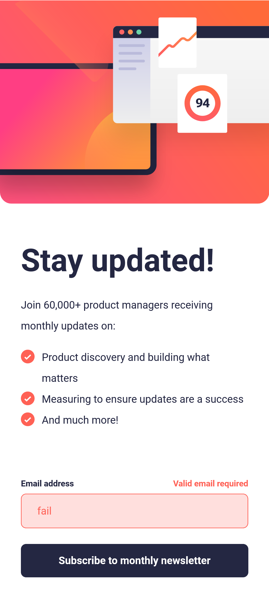
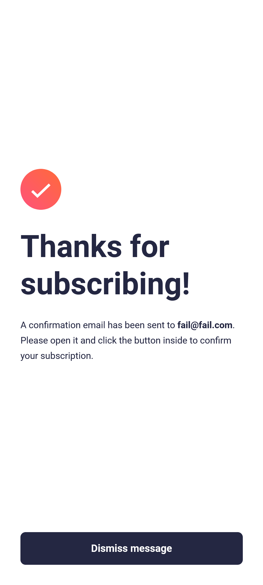

# Frontend Mentor - Newsletter sign-up form with success message solution

This is a solution to the [Newsletter sign-up form with success message challenge on Frontend Mentor](https://www.frontendmentor.io/challenges/newsletter-signup-form-with-success-message-3FC1AZbNrv). Frontend Mentor challenges help you improve your coding skills by building realistic projects. 

## Table of contents

- [Frontend Mentor - Newsletter sign-up form with success message solution](#frontend-mentor---newsletter-sign-up-form-with-success-message-solution)
	- [Table of contents](#table-of-contents)
	- [Overview](#overview)
		- [The challenge](#the-challenge)
		- [Screenshot](#screenshot)
		- [Links](#links)
	- [My process](#my-process)
		- [Built with](#built-with)
		- [What I learned](#what-i-learned)
		- [Continued development](#continued-development)
		- [Useful resources](#useful-resources)
	- [Author](#author)
	- [Acknowledgments](#acknowledgments)

**Note: Delete this note and update the table of contents based on what sections you keep.**

## Overview

### The challenge

Users should be able to:

- Add their email and submit the form
- See a success message with their email after successfully submitting the form
- See form validation messages if:
  - The field is left empty
  - The email address is not formatted correctly
- View the optimal layout for the interface depending on their device's screen size
- See hover and focus states for all interactive elements on the page

### Screenshot

### Links

- [Solution URL](https://github.com/josejovian/frontendmentor-challenges/tree/main/newsletter-sign-up-with-success-message-main)
- [Live Site URL](https://josejovian.github.io/frontendmentor-challenges/newsletter-sign-up-with-success-message-main/)

## My process

### Built with

- Semantic HTML5 markup
- CSS custom properties
- Flexbox
- Javascript

### What I learned

I spent more than enough time working with the email validation part until I decided to not reinvent the wheel, so I used regex, specifically this one created by [Andy Lester on SO](https://stackoverflow.com/a/201447/23102070), to do it. From that thread, I found that it was basically impossible to have a very simple regex to validate emails. That is why, for this challenge, I picked a simple regex that was enough to validate most common emails.

### Continued development

I will focus more on reviewing CSS, since I spent more than enough time to style in this challenge.

### Useful resources

- [StackOverflow (Andy Lester): Regex to validate email](https://stackoverflow.com/a/201447/23102070) - The whole thread is about attempting to validate emails with regex.
- [CSS gradient](https://cssgradient.io/) - Useful website to quickly generate a gradient background. 

## Author

- GitHub - [Jose Jovian](https://github.com/josejovian)

## Acknowledgments

- [StackOverflow (Andy Lester): Regex to validate email](https://stackoverflow.com/a/201447/23102070)