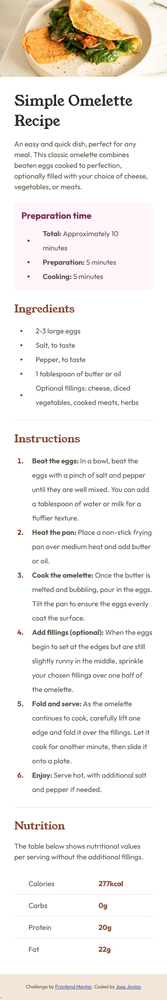

# Frontend Mentor - Recipe page solution

This is a solution to the [Recipe page challenge on Frontend Mentor](https://www.frontendmentor.io/challenges/recipe-page-KiTsR8QQKm). Frontend Mentor challenges help you improve your coding skills by building realistic projects. 

## Table of contents

- [Frontend Mentor - Recipe page solution](#frontend-mentor---recipe-page-solution)
	- [Table of contents](#table-of-contents)
	- [Overview](#overview)
		- [Screenshot](#screenshot)
		- [Links](#links)
	- [My process](#my-process)
		- [Built with](#built-with)
		- [What I learned](#what-i-learned)
		- [Continued development](#continued-development)
		- [Useful resources](#useful-resources)
	- [Author](#author)
	- [Acknowledgments](#acknowledgments)

## Overview

### Screenshot

### Links

- [Solution URL](https://github.com/josejovian/frontendmentor-challenges/tree/main/recipe-page)
- [Live Site URL](https://josejovian.github.io/frontendmentor-challenges/recipe-page/)

## My process

### Built with

- Semantic HTML5 markup
- CSS custom properties

**Note: These are just examples. Delete this note and replace the list above with your own choices**

### What I learned

Though this was a straight-forward challenge, I spent a lot of time figuring out how to work with BEM naming convention for the styling. One interesting part about this challenge was the bullet points' placement in the unordered lists. I noticed this particular detail late in the challenge, and I decided to not ignore this detail.  

Immediately, I tried configuring the padding/margin of the marker with the marker psuedo element, but it had no effect. As I could not
figure out any way to achieve this effect, I googled and found a trick by [luenib](https://stackoverflow.com/a/51957183/23102070). Since the cells in CSS tables, by default, seem to be vertically centered, list items can be made to behave like a table to achieve the vertically centered effect. This can be done by applying `display: table` on a list, and `display: table-cell` on a list item. However, custom markers must be placed in each list item.

### Continued development

I may focus more on BEM naming convention.

### Useful resources

- [StackOverflow (luenib): Display list item as tables to place the bullet points depend on the list items' height](https://stackoverflow.com/a/51957183/23102070)

## Author

- Frontend Mentor - [@yourusername](https://github.com/josejovian)

## Acknowledgments

- [StackOverflow (luenib): Display list item as tables to place the bullet points depend on the list items' height](https://stackoverflow.com/a/51957183/23102070)